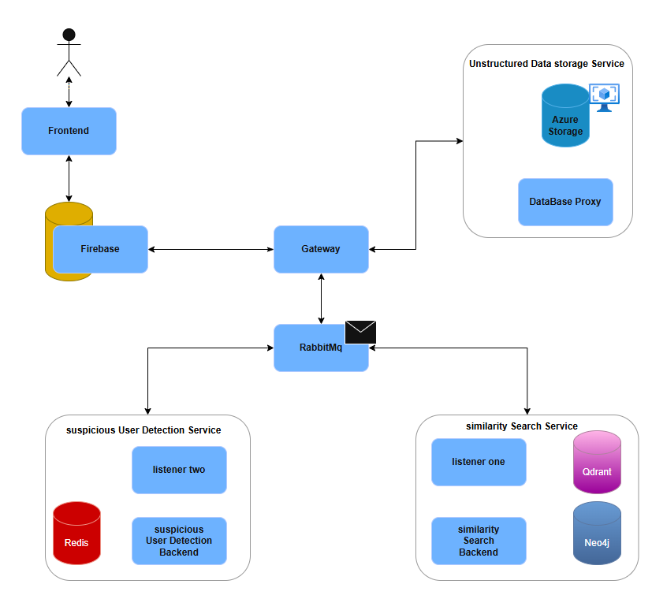
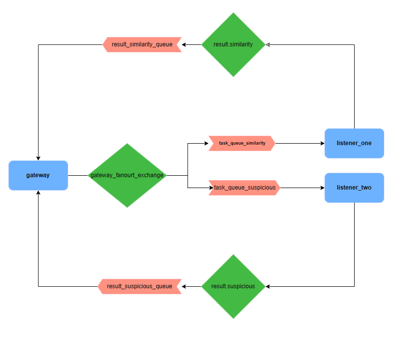

# LostFound System: Messaging Infrastructure and Smart Matching/Fraud Detection Microservices

## Introduction

The LostFound system is designed to facilitate the recovery of lost items and the detection of fraudulent activities related to lost and found reports. This comprehensive system leverages a robust messaging infrastructure and intelligent microservices for smart matching and fraud detection to ensure efficient and secure operations. The project is divided into three main repositories: `lostfound-messaging-infrastructure` and `lostfound-smart_matching-and-fraud_detection-microservices` and `FoundIt`.

## System Architecture

The overall architecture of the LostFound system is designed to be modular, scalable, and resilient, utilizing a microservices approach. The core components interact through a central messaging queue (RabbitMQ) and various specialized services to handle different aspects of the lost and found process. Below is a high-level overview of the system components and their interactions:


### Core Components

Based on the provided system architecture diagram , the LostFound system comprises the following key components:

*   **Frontend**: The user-facing application where users can report lost or found items, and interact with the system.
*   **Firebase**: Used for user authentication, real-time database functionalities, and potentially other backend services provided by Google Firebase.
*   **Gateway**: Acts as an API Gateway, routing requests from the Frontend to the appropriate microservices and handling communication with RabbitMQ.
*   **RabbitMQ**: A message broker that facilitates asynchronous communication between different microservices. It ensures reliable message delivery and decouples services, enhancing scalability and fault tolerance.
*   **Unstructured Data Storage Service**: Responsible for storing and managing unstructured data, likely related to item descriptions, images, or other media. It utilizes **Azure Storage** for blob storage and a **Database Proxy** for managing access.
*   **Suspicious User Detection Service**: A microservice dedicated to identifying and flagging suspicious user activities or fraudulent reports. It uses **Redis** for fast data access and a **Suspicious User Detection Backend** for processing and analysis.
*   **Similarity Search Service**: This microservice is crucial for matching lost and found items. It leverages **Qdrant** (a vector similarity search engine) and **Neo4j** (a graph database) to perform intelligent matching based on item attributes and descriptions.

### Message Flow and Inter-service Communication

This diagram illustrates the message flow within the system, particularly how RabbitMQ is utilized for inter-service communication:


1.  **Gateway to RabbitMQ**: The `gateway` sends messages to a `gateway_fanout_exchange`. A fanout exchange broadcasts messages to all queues bound to it.
2.  **Task Queues**: From the `gateway_fanout_exchange`, messages are routed to two distinct task queues:
    *   `task_queue_similarity`: Messages related to similarity search tasks are sent here.
    *   `task_queue_suspicious`: Messages related to suspicious user detection tasks are sent here.
3.  **Listeners**: Each task queue has a dedicated listener:
    *   `listener_one`: Consumes messages from `task_queue_similarity` and processes them using the **Similarity Search Service**.
    *   `listener_two`: Consumes messages from `task_queue_suspicious` and processes them using the **Suspicious User Detection Service**.
4.  **Result Queues**: After processing, the listeners send their results back to RabbitMQ:
    *   `result_similarity_queue`: Contains results from the **Similarity Search Service**.
    *   `result_suspicious_queue`: Contains results from the **Suspicious User Detection Service**.
5.  **Results to Gateway**: The `gateway` consumes messages from both `result_similarity_queue` and `result_suspicious_queue` to receive the processed results and respond to the Frontend.

This asynchronous message-driven architecture ensures that the system can handle a high volume of requests, and that individual services can operate independently, improving overall system performance and reliability.


## Repository: `lostfound-messaging-infrastructure`

This repository houses the core components of the LostFound system's messaging infrastructure, primarily focusing on the `gateway`, `listener_one`, `listener_two`, and `storage_proxy` services. These services are instrumental in handling message routing, processing, and data storage operations.

### Services Overview

*   **`gateway`**: This service acts as the central entry point for external communications, routing messages to the appropriate internal services via RabbitMQ. It is responsible for orchestrating the flow of information between the frontend and the backend microservices.
*   **`listener_one`**: This listener service is designed to consume messages from `task_queue_similarity` in RabbitMQ. It processes these messages and interacts with the `similarity_search_service` (located in the `lostfound-smart_matching-and-fraud_detection-microservices` repository) to perform item matching operations.
*   **`listener_two`**: Similar to `listener_one`, this service consumes messages from `task_queue_suspicious` in RabbitMQ. It processes these messages and interacts with the `suspicious_user_detection_service` (also in the `lostfound-smart_matching-and-fraud_detection-microservices` repository) to identify and flag suspicious activities.
*   **`storage_proxy`**: This service is responsible for handling interactions with the unstructured data storage, specifically Azure Storage. It acts as a proxy, abstracting the complexities of direct storage access from other services.

### Technologies Used

Based on the repository content, the `lostfound-messaging-infrastructure` primarily uses Python. The presence of `docker-compose.yml` files indicates that these services are containerized using Docker, facilitating easy deployment and management.

### Setup and Installation

To set up and run the services within this repository, follow these steps:

1.  **Clone the repository**:

    ```bash
    git clone https://github.com/AchrefHemissi/lostfound-messaging-infrastructure.git
    cd lostfound-messaging-infrastructure
    ```

2.  **Environment Configuration**: Each service (`gateway`, `listener_one`, `listener_two`, `storage_proxy`) might require specific environment variables for configuration (e.g., RabbitMQ connection strings, Azure Storage credentials). Refer to the `.env` files or configuration sections within each service's directory for details.

3.  **Docker Compose**: The `docker-compose.yml` files in each service directory can be used to build and run the services. Navigate to each service's directory and run:

    ```bash
    docker-compose up --build
    ```

    This will build the Docker images and start the containers for the respective service and its dependencies (e.g., RabbitMQ).

4.  **Dependencies**: Ensure you have Docker and Docker Compose installed on your system.


## Repository: `lostfound-smart_matching-and-fraud_detection-microservices`

This repository contains the microservices responsible for the intelligent aspects of the LostFound system: smart matching of items and the detection of fraudulent activities. The key services within this repository are `similarity_search_service` and `suspicious_user_detection_service`.

### Services Overview

*   **`similarity_search_service`**: This service is a modular FastAPI microservice designed for generating and searching image/text embeddings. It leverages OpenAI's CLIP model for creating embeddings and Qdrant as a vector store for efficient similarity searches. This service is crucial for matching lost and found items based on their visual and textual descriptions. It also integrates with Neo4j, a graph database, likely for more complex relationship-based matching or data enrichment.

    *   **Project Structure (as observed from its README)**:
        *   `app/`: Main application code.
            *   `main.py`: FastAPI app entry point.
            *   `api/`: API layer with HTTP routes and dependencies.
                *   `v1/`, `v2/`: API routes for text/image embedding.
                *   `dependencies.py`: Shared dependencies (model loaders, DB, etc.).
            *   `core/`: Core settings and configuration.
                *   `config.py`: Loads environment variables and app settings.
                *   `logger.py`: App-wide logging configuration.
            *   `services/`: Core business logic.
                *   `clip_service.py`: CLIP model loading and embedding.
                *   `vector_service.py`: Vector database (Qdrant/FAISS) operations.
            *   `models/`: Pydantic request/response models.
                *   `embedding_request.py`
            *   `utils/`: Utility functions.
                *   `image_utils.py`: Image preprocessing for CLIP.
        *   `tests/`: Unit and integration tests.
        *   `test_images/`: Sample images for testing.
        *   `.env`: Environment variables.
        *   `requirements.txt`: Python dependencies.
        *   `README.md`: Project overview and instructions.

*   **`suspicious_user_detection_service`**: This microservice is dedicated to identifying and flagging suspicious user activities or fraudulent reports. While its specific internal mechanisms are not detailed in the provided GitHub README, the system architecture diagram indicates its reliance on Redis for fast data access and a dedicated backend for processing and analysis. It likely analyzes user behavior, report patterns, and other relevant data to detect anomalies.

### Technologies Used

This repository primarily utilizes Python, FastAPI for building the microservices, OpenAI's CLIP model for embeddings, Qdrant for vector search, Neo4j for graph database capabilities, and Redis for caching/fast data access. Docker and Docker Compose are used for containerization and orchestration.

### Setup and Installation

To set up and run the services within this repository, follow these steps:

1.  **Clone the repository**:

    ```bash
    git clone https://github.com/AchrefHemissi/lostfound-smart_matching-and-fraud_detection-microservices.git
    cd lostfound-smart_matching-and-fraud_detection-microservices
    ```

2.  **Environment Configuration**: Each service (`similarity_search_service`, `suspicious_user_detection_service`) will require specific environment variables (e.g., API keys for OpenAI, database connection strings). Refer to the `.env` files or configuration sections within each service's directory.

3.  **Docker Compose**: Navigate to each service's directory and use `docker-compose` to build and run the services:

    ```bash
    docker-compose up --build
    ```

    This will set up the necessary containers, including the service itself and its dependencies (e.g., Qdrant, Neo4j, Redis).

4.  **Dependencies**: Ensure you have Docker and Docker Compose installed.


## Contributing

Contributions to the LostFound system are welcome! If you'd like to contribute, please follow these steps:

1.  Fork the repository.
2.  Create a new branch for your feature or bug fix.
3.  Make your changes and ensure they adhere to the project's coding standards.
4.  Write and run tests to ensure your changes work as expected and don't introduce regressions.
5.  Commit your changes with clear and concise commit messages.
6.  Push your branch to your forked repository.
7.  Create a pull request to the `main` branch of the original repository, describing your changes in detail.
8.  

# Frontend & Backend of the mobile App 

## 🚀 Technology Stack

- **Mobile Development**: Flutter
- **Backend & Database**: Firebase (Firestore, Authentication, Storage, Functions)
- **Authentication**: Firebase Auth with OAuth integration
- **Maps Integration**: Geographic mapping services
- **Push Notifications**: Firebase Cloud Messaging (FCM)

## 🎯 Target Users

- **General Public**: Anyone who has lost or found personal items
- **Students**: University and school communities with high item turnover
- **Travelers**: Airport, hotel, and transportation hub users
- **Event Attendees**: Conference, concert, and public event participants
- **Community Members**: Local neighborhoods and community organizations

### Prerequisites
- Flutter SDK (latest stable version)
- Dart SDK
- Android Studio / VS Code with Flutter extensions
- Firebase account and project setup

### Installation

1. **Clone the repository**
   ```bash
   git clone https://github.com/Dhia9030/FoundIt.git
   cd FoundIt
   ```

2. **Install dependencies**
   ```bash
   flutter pub get
   ```

3. **Firebase Setup**
   - Create a new Firebase project at [Firebase Console](https://console.firebase.google.com)
   - Enable Authentication, Firestore Database, and Storage
   - Download `google-services.json` (Android) and `GoogleService-Info.plist` (iOS)
   - Place the configuration files in their respective platform directories

4. **Run the app**
   ```bash
   flutter run
   ```

### Firebase Configuration
Make sure to enable the following Firebase services:
- **Authentication**: Email/Password and OAuth providers
- **Firestore Database**: For storing item reports and user data
- **Storage**: For uploading item photos
- **Cloud Functions**: For AI matching and notifications
  
Development Commands
```bash
flutter run  //Run the app in debug mode
flutter build apk  //Build APK for Android
flutter build ios  //Build for iOS
flutter test  //Run unit tests
```

## License

This project is licensed under the Apache License - see the [LICENSE](LICENSE) file for details.


